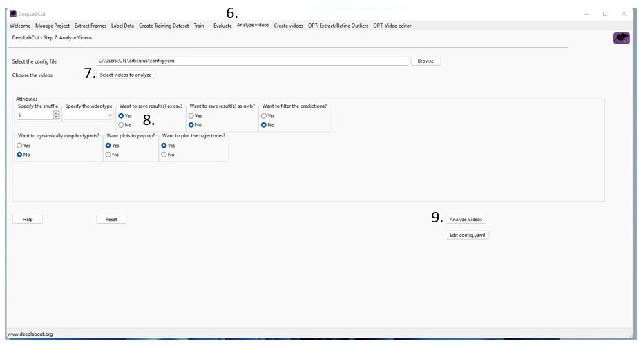

# articulus
CV quantification of joint mobility in elephants.

---
## Requirements
The model was trained using the open-source tool [DeepLabCut](https://github.com/DeepLabCut/DeepLabCut) <br>
The easiest way to access and use the model at this time is through DeepLabCut.  

Both articulus and DeepLabCut require [Python](), version 3.6 or higher.

Joint analysis requires the following Python packages:
* numpy
* pandas
* math
* matplotlib
* seaborn

If the .ipynb is opened through Google Collab, however, it is not necessary to install those packages. 

## Step 1: Create Pose Estimations

1. Install DeepLabCut
2. Download the articulus repository
3. Open the DeepLabCut gui by running in the command line:
```bash
> python -m deeplabcut 
```
4. Navigate to the "Manage Project" tab and select Load existing project
5. Select the config file from the repository and press "Ok"
6. Navigate to the "Analyze videos" tab
7. Select videos to analyze
8. Select "yes" for the option "Want to save result(s) as csv?
9. Select Analyze Videos <br>



## Step 2: Analyze Range of Motion


Each joint comprises two vectors, one from point P1 to P2 (vector a) and one from P1 to P3 (vector b), with P1 as the vertex. The length of each vector is 

a = (p1.x - p2.x, p1.y - p2.y)<br>
b = (p1.x - p3.x, p1.y - p3.y)

You can then invert the dot product formula to get the angle between the two vectors:<br>
 <br>

Using the .csv files outputed by Step 1, get visual representation of the mobility of each joint from the ipynb notebook. 

1. 
